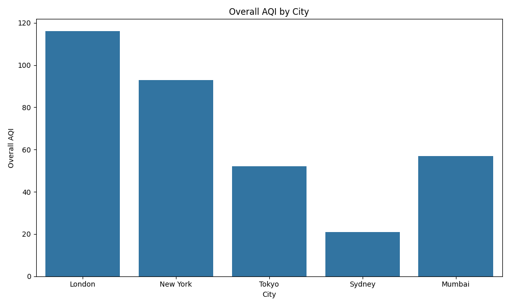

# Air Quality Data Ingestion Pipeline




## Project Overview

The goal of this project is to create a robust data ingestion pipeline for retrieving, processing, and storing air quality data from the AirVisual API. The pipeline is automated using Apache Airflow for scheduling and orchestration, and Docker for containerization, ensuring scalability and consistency.

## Setup Instructions

### Prerequisites

- Docker
- Docker Compose
- AirVisual API Key
- Python 3.8+

### Steps

1. Clone the repository:

   ```bash
   git clone https://github.com/beblicarl/air-quality-data-pipeline.git
   cd air-quality-data-ingestion
   ```

2. Add your Air quality API key to the `docker-compose.yml` file under the `data_fetcher` service.

3. Build and start the Docker containers:

   ```bash
   cd airflow
   docker-compose up --build
   ```

4. Access the Airflow UI at `http://localhost:8080`.

## Usage

The data fetching task runs periodically and fetches air quality data for specified cities, storing the results in a PostgreSQL database.

## Fetching Air Quality Data

### API Key

Ensure you have an API key from AirVisual. Set this key in the environment variables or directly in the docker-compose.yml under the data_fetcher service.

### Trigger the DAG

In the Airflow web UI, trigger the air_quality_data_pipeline DAG to initiate the data ingestion process.

### Monitoring

Monitor the progress and status of the DAG in the Airflow web UI. The DAG will fetch air quality data, process it, and store it in the PostgreSQL database.

## Accessing the Data

### Connect to the Database

Use a database client to connect to the PostgreSQL database:

1. Host: localhost
2. Port: 5432
3. User: postgres
4. Password: password
5. Database: airquality_db

### Query the Data

Utilize SQL queries to access and analyze the air quality data stored in the database.

## Directory Structure

- `airflow/`: Contains the Airflow setup and DAG definition.
- `database/`: Includes the database setup script and Dockerfile.
- `data_fetching/`: Houses the data fetching script and Dockerfile.
- `requirements.txt`: Lists Python dependencies.

## Technical Tools and Technologies

- **Python**: Scripting language.
- **PostgreSQL**: Database.
- **Docker**: Containerization.
- **Apache Airflow**: Workflow management.
- **Requests**: HTTP library for API calls.
- **Pandas**: Data manipulation library.
- **SQLAlchemy**: SQL toolkit and Object-Relational Mapping (ORM) library.
